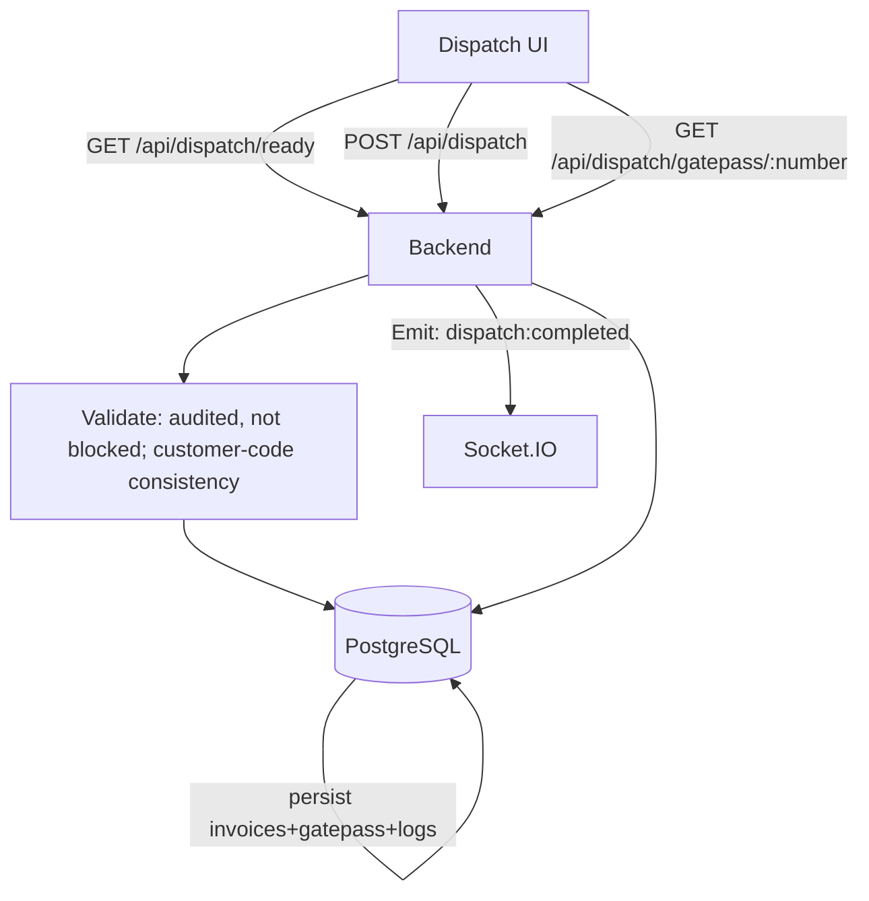

# Dispatch Hub — System & Security Architecture Documentation
**Document ID:** DH-ARCH-SEC-001  
**Version:** 1.0  
**Date:** 2026-01-27  
**Status:** Draft (Senior Review)  
**Prepared for:** Senior/Architecture & Security Review  
**Repository:** `dispatch-hub` (workspace root)  
**Classification:** Internal  
**Scope:** Application + infrastructure reference architectures; security policies and matrices aligned to current codebase behavior.

---

## Table of Contents
1. High‑Level Solution Architecture  
2. Data Flow Diagrams (DFD)  
3. Application Inventory (new vs existing components) + Hosting Model Description  
4. Network Architecture Diagram  
5. Cloud Security Shared Responsibility Matrix  
6. System Hardening Standards  
7. Patch & Vulnerability Management Policy + Access Control Policy  
8. Authentication & Authorization Design  
9. Privileged Access Management (PAM) Policy  
10. Role‑based Access Control (RBAC) Matrix  
11. User Provisioning & De‑Provisioning Process  
Appendix A. Data Model Overview (PostgreSQL)  
Appendix B. Interfaces (API + WebSocket events)  
Appendix C. Implementation Evidence (code references)  

---

## Executive Summary
Dispatch Hub is a **web-based operational system** that supports:
- **Invoice ingestion** (Excel upload) and persistence to PostgreSQL
- **Schedule ingestion** (Excel upload; optional and used as supporting metadata in an “invoice-first” workflow)
- **Document audit** via barcode/QR scanning, with mismatch detection and blocking
- **Dispatch loading** and **gatepass generation/verification**
- **Real-time multi-device updates** using Socket.IO

Technology stack:
- **Frontend:** Vite + React + TypeScript + shadcn-ui + Tailwind (`frontend/`)
- **Backend:** Node.js + Express + TypeScript + Socket.IO (`backend/`)
- **Database:** PostgreSQL with SQL migrations (`backend/migrations/`)

Deployment options evidenced in repo:
- **AWS EC2 + Nginx reverse proxy** pattern (`deploy/nginx.dispatch-hub.conf`, `PRODUCTION_DEPLOYMENT_EC2.md`)
- **Render backend service** definition (`render.yaml`)
- **Vercel frontend** support (`frontend/vercel.json`)

---

## Assumptions & Constraints
- This document reflects the **current repository implementation** (not an abstract target state).
- Environment variables and secrets are **not reproduced** in this document.
- Hosting model may differ per environment; diagrams and responsibility matrices include **recommended** options (AWS EC2+RDS) and **supported** options (Render/Vercel).

---

## 1) High‑Level Solution Architecture

### 1.1 Logical Architecture (components)
- **Users**
  - Operators (standard users)
  - Administrators (exception review, analytics)
- **Frontend Web App (Browser)**
  - Provides UI for login, upload, doc-audit, dispatch, gatepass verification, analytics/admin pages.
  - Uses JWT stored client-side and sent as `Authorization: Bearer <token>`.
  - Subscribes to real-time events via Socket.IO.
- **Backend API (Express + TypeScript)**
  - Exposes REST endpoints under `/api/*`.
  - Handles uploads and parsing using `multer` + `xlsx`.
  - Enforces auth via JWT middleware; admin-only endpoints via role guard.
  - Emits real-time events via Socket.IO.
- **WebSocket layer (Socket.IO server)**
  - Auth-aware socket connections (optional JWT at handshake).
  - Broadcasts domain events such as invoice updates, schedule updates, audit progress, dispatch completion, mismatch alerts.
- **PostgreSQL**
  - Persists all domain data: invoices, invoice items, scan logs, mismatch alerts, schedules, gatepasses, system logs, users, preferences.

### 1.2 Runtime Architecture (recommended production)
**Same-origin architecture** is recommended:
- The frontend calls backend via **relative** `/api/...` and `/socket.io/...`.
- An edge proxy (typically Nginx) routes these to the backend.

Benefits:
- Avoids browser CORS/Private Network Access issues.
- Simplifies security controls and cookie/origin constraints (even though JWT is used).

---

## 2) Data Flow Diagrams (DFD)

### 2.1 DFD Level 0 (Context diagram)
```mermaid
flowchart LR
  U[User: Operator/Admin] -->|Web UI| FE[Frontend (Browser)]
  FE -->|REST /api/*| BE[Backend API]
  FE <-->|Socket.IO| WS[Realtime Events]
  BE -->|Emit events| WS
  BE <-->|SQL| DB[(PostgreSQL)]
```

### 2.2 DFD Level 1 (process flows)

#### A) Upload (Invoices + optional Schedule)
```mermaid
flowchart TD
  U[User] --> FE[Upload UI]
  FE -->|POST /api/schedule/upload (optional)| BE[Backend]
  FE -->|POST /api/invoices/upload| BE
  BE --> P[Parse + Validate Excel]
  P --> DB[(PostgreSQL)]
  BE --> DBL[Insert upload logs] --> DB
  BE -->|Emit: schedule:updated / invoices:updated| WS[Socket.IO]
  WS --> FE2[Other browsers/devices refresh]
```

#### B) Document Audit (Scan → Validate → Persist → Notify)
```mermaid
flowchart TD
  U[User] --> FE[Doc Audit UI]
  FE -->|POST /api/audit/:invoiceId/scan OR /scan-stage| BE[Backend]
  BE --> V[Canonicalize barcode + server-side QR parsing]
  V -->|Write scan row(s) + counters| DB[(PostgreSQL)]
  V -->|On mismatch/over-scan: create mismatch_alert + block invoice| DB
  BE -->|Emit: audit:progress / audit:scan / alert:new| WS[Socket.IO]
  WS --> FE
  WS --> FE_ADMIN[Admin UI]
  FE_ADMIN -->|PUT /api/admin/exceptions/:id| BE
  BE -->|Unblock + conditional cleanup| DB
  BE -->|Emit: alert:resolved| WS
```

#### C) Dispatch (Ready → Load → Gatepass)


---

## 3) Application Inventory (new vs existing components) + Hosting Model Description

### 3.1 Application Inventory

#### A) Custom business components (Dispatch Hub-specific)
**Backend (`backend/src/`)**
- `index.ts`: Express app, CORS, route mounting, Socket.IO initialization.
- `middleware/auth.ts`: JWT verification, attaches user payload to request.
- `middleware/roleGuard.ts`: admin-only enforcement for `/api/admin/*`.
- `routes/`:
  - `auth.ts`: login/verify/me, selections, scanner preferences.
  - `invoices.ts`: list/get, Excel upload, delete; emits `invoices:updated`.
  - `schedule.ts`: list/upload/clear schedule; emits `schedule:updated`.
  - `audit.ts`: scan endpoints, mismatch reporting and invoice blocking; emits `audit:*`, `alert:*`.
  - `dispatch.ts`: readiness, dispatch execution, gatepasses; emits `dispatch:completed`.
  - `admin.ts`: analytics, exception alerts review/resolution, master-data endpoints (admin-only).
  - `logs.ts`: retrieve system logs by type.
- `websocket/socketHandler.ts`: socket auth middleware + room membership + event relays.
- `config/database.ts`: PG pool with optional AWS RDS SSL handling.
- `utils/`: date parsing, barcode normalization, QR nomenclature parsing, scanner preferences helpers.

**Frontend (`frontend/src/`)**
- `lib/api.ts`: API client wrapper with JWT header injection; production-safe API URL handling (prefers same-origin).
- `lib/socket.ts`: Socket.IO client with reconnection and typed subscriptions.
- `contexts/SessionContext.tsx`: session/user state; refresh logic; subscribes to websocket updates.
- `pages/`: operational and admin screens (Upload, DocAudit, Dispatch, Gatepass Verification, Analytics, Exception Alerts, Master Data, etc.).
- `components/BarcodeScanner.tsx`: scanning UX (camera/scanner).

**Database schema (`backend/migrations/`)**
- Base schema: `001_initial.sql` (users/invoices/invoice_items/schedule_items/validated_barcodes/logs/mismatch_alerts/user_selections/gatepasses)
- Enhancements: bin tracking, dual counters, scanner preferences, schedule quantity, gatepass enhancements, etc.

#### B) Existing frameworks / third‑party libraries
- Frontend scaffolding: Vite, React, Tailwind, shadcn/Radix components.
- Backend libraries: Express, Socket.IO, PG, JWT, bcrypt, multer, XLSX.

### 3.2 Hosting Model Description

#### Option 1 — AWS EC2 + Nginx + PostgreSQL (RDS recommended)
- **Frontend:** static build served by Nginx.
- **Backend:** Node process on EC2 (internal port 3001) behind Nginx proxy.
- **Database:** PostgreSQL on AWS RDS (or self-managed as an exception).
- **Why recommended:** same-origin proxying avoids CORS/PNA issues and simplifies networking.

#### Option 2 — Render backend + managed Postgres
- `render.yaml` defines a Node web service for backend.
- Database can be Render Postgres or external Postgres.
- Frontend can be Vercel/static hosting.

#### Option 3 — Vercel frontend + backend elsewhere
- `frontend/vercel.json` supports Vercel deployment.
- Backend hosted on Render/EC2; ensure frontend base URL strategy is consistent (prefer same-origin where possible).

---

## 4) Network Architecture Diagram

### 4.1 Recommended (EC2 + Nginx reverse proxy; backend private)
```mermaid
flowchart LR
  U[Browser / Mobile] -->|HTTPS 443| NGINX[Nginx (edge)]
  NGINX -->|Serve static| FE[Frontend assets]
  NGINX -->|/api/* proxy| BE[Backend :3001]
  NGINX -->|/socket.io/* proxy (WS upgrade)| BE
  BE -->|5432| DB[(PostgreSQL/RDS)]
```

### 4.2 Port & trust boundaries (summary)
- **Public**: 443 (TLS) to Nginx/edge.
- **Private**: 3001 (backend) accessible only from edge/localhost; 5432 (DB) only from backend security group/subnet.

---

## 5) Cloud Security Shared Responsibility Matrix

### 5.1 AWS EC2 + RDS (recommended reference)
| Control Area | Cloud Provider (AWS) | Customer (You) |
|---|---|---|
| Physical security | ✅ | — |
| Availability of core services | ✅ | — |
| VPC substrate | ✅ | VPC design, routing, SG/NACL rules |
| EC2 host OS | — | Hardening, patching, SSH controls, monitoring |
| RDS managed service | ✅ (platform) | DB config, IAM, networking, backups/retention, credentials |
| Application security | — | AuthN/AuthZ, input validation, dependency hygiene, logging |
| Secrets management | Service availability | Define storage, rotation, access, auditing |
| Incident response | Platform events | Runbooks, detection, containment, notification |

### 5.2 Render/Vercel (PaaS/SaaS)
Providers manage more platform controls; customer remains responsible for:
- Application security, identity/roles, secrets, data governance, configuration, and operational access governance.

---

## 6) System Hardening Standards

### 6.1 Host/OS hardening (if EC2)
- **Access**
  - SSH key-only auth; disable password auth; restrict to allowlisted IPs.
  - Separate admin accounts; no shared root usage.
- **Baseline**
  - CIS-aligned configuration (or equivalent).
  - Remove unused services/packages; enable firewall; enable log rotation.
- **Process/runtime**
  - Run backend as non-root user.
  - Use systemd/pm2 with restart policies and resource limits.
- **TLS**
  - Enforce HTTPS at edge; HSTS policy if appropriate.
  - Camera scanning on mobile requires HTTPS (non-localhost).

### 6.2 Nginx hardening (edge)
- Disable server tokens; apply security headers; strict request size/timeouts.
- Ensure WebSocket upgrade is configured for `/socket.io/`.

### 6.3 Database hardening
- Private network only; restrict inbound to backend SG.
- Least privilege DB role for app; rotate credentials.
- Encrypt in transit (TLS) and at rest (RDS encryption recommended).

---

## 7) Patch & Vulnerability Management Policy + Access Control Policy

### 7.1 Patch & Vulnerability Management Policy (policy baseline)
**Scope:** OS packages, Nginx, Node runtime, npm dependencies (frontend+backend), PostgreSQL engine, container/runtime (if used).

**Cadence**
- **Critical / exploited**: mitigate within **48–72 hours**
- **High**: **7 days**
- **Medium**: **30 days**
- **Low**: **90 days**

**Practices**
- SCA scanning for npm dependencies (CI or scheduled).
- Monthly OS patch window + emergency patch path.
- Maintain an exception register with compensating controls and expiry dates.

### 7.2 Access Control Policy (policy baseline)
- Enforce **least privilege** at every layer: app, cloud, OS, DB.
- Admin actions require MFA at cloud level; app admins restricted to named accounts.
- All access paths must be logged and reviewable.

---

## 8) Authentication & Authorization Design

### 8.1 Authentication
- Username/password login (`/api/auth/login`) verified against bcrypt hash in `users`.
- Backend issues **JWT** with expiry (`JWT_EXPIRES_IN`).
- Frontend stores token in `localStorage` and sends `Authorization: Bearer <token>`.
- Token validation via `/api/auth/verify`; user context via `/api/auth/me`.

### 8.2 Authorization
- Default: **JWT required** for `/api/*` routes.
- **Admin-only**: `/api/admin/*` guarded by role middleware (`requireAdmin`).
- Business rules enforced server-side include:
  - Prevent re-upload of invoices once audited/dispatched.
  - De-duplication and bin-limit enforcement for loading scans.
  - Mismatch alerts trigger **invoice blocking** until admin resolution.

### 8.3 WebSocket auth
- Socket handshake can include JWT; server decodes for identity/role.
- Admin sockets join an `admins` room for alert visibility.

---

## 9) Privileged Access Management (PAM) Policy

### 9.1 Privileged roles in scope
- **Application Admin** (role=`admin`)
- **Cloud administrators** (AWS/Render/Vercel)
- **Database administrators** (RDS/Postgres)
- **Host administrators** (EC2/OS)

### 9.2 PAM controls (recommended)
- MFA mandatory for cloud console access and privileged IAM roles.
- No shared admin credentials; named accounts only.
- “Break-glass” access:
  - Stored in secure vault; access logged; rotate after use.
- Session governance:
  - Time-bounded sessions; just-in-time elevation where possible.
- Audit and review:
  - Quarterly review of privileged accounts and role memberships.

---

## 10) Role‑based Access Control (RBAC) Matrix

### 10.1 Roles
- **user**: standard operations (upload, doc-audit, dispatch, logs)
- **admin**: all user capabilities + analytics, exceptions, master-data

### 10.2 RBAC matrix (features/endpoints)
| Feature / Capability | user | admin |
|---|---:|---:|
| Login / token verification / user profile | ✅ | ✅ |
| Upload invoices | ✅ | ✅ |
| Upload schedule (optional) | ✅ | ✅ |
| View invoices | ✅ | ✅ |
| Doc-audit scanning + progress | ✅ | ✅ |
| Dispatch (ready/dispatch/gatepass) | ✅ | ✅ |
| View logs | ✅ | ✅ |
| Analytics (`/api/admin/analytics`) | ❌ | ✅ |
| Exception alerts list (`/api/admin/exceptions`) | ❌ | ✅ |
| Resolve exception (approve/reject) | ❌ | ✅ |
| Master data/users list (`/api/admin/master-data`, `/api/admin/users`) | ❌ | ✅ |

**Governance note:** some operationally sensitive actions exist outside `/api/admin/*` (e.g., invoice deletion, schedule clear) and are currently JWT-protected. Policy should treat them as privileged until/unless enforced by code.

---

## 11) User Provisioning & De‑Provisioning Process

### 11.1 Provisioning (recommended)
1. Access request submitted with business justification and required role.
2. Approval by system owner/security (for admin).
3. Create user in `users` table with bcrypt password hash and assigned role.
4. Deliver credentials securely; require rotation/initial password reset (recommended).
5. Validate effective access with least privilege.

### 11.2 De‑Provisioning
1. Triggered by exit/role change/vendor offboarding.
2. Disable access immediately (recommended: a disabled flag; otherwise credential revocation/removal).
3. Rotate any shared secrets (recommended: none).
4. Review recent activity via logs and admin actions.
5. Retain audit data per retention policy.

### 11.3 Periodic access reviews
- Quarterly review of:
  - Admin users
  - Cloud IAM privileged roles
  - DB administrative access

---

## Appendix A — Data Model Overview (PostgreSQL)

### A.1 Core entities (high level)
- `users`: identity + role (`admin`/`user`)
- `invoices`: invoice header and lifecycle flags (audit/dispatch/blocking)
- `invoice_items`: line items + scan counters
- `schedule_items`: schedule rows (delivery date/time/unloading metadata; customer_code may be nullable post-migration)
- `validated_barcodes`: scan records (doc-audit and loading-dispatch), staged scan support, bin numbers for de-duplication
- `mismatch_alerts`: exception workflow requiring admin review
- `gatepasses`: generated gatepasses for dispatch, includes customer_code and dispatch_date in enhanced schema
- `logs`: audit trail for uploads/audit/dispatch/system
- `user_selections`: saved selection of customer/site
- `user_scanner_preferences`: per-user scan behavior preferences

### A.2 Primary relationships
- `invoices (1) -> (N) invoice_items`
- `invoices (1) -> (N) validated_barcodes`
- `invoices (1) -> (N) mismatch_alerts` (nullable FK for deleted invoices)
- `users (1) -> (1) user_scanner_preferences` (unique by user)
- `users (1) -> (0..1) user_selections`

---

## Appendix B — Interfaces (API + WebSocket events)

### B.1 REST interface overview
- Auth: `/api/auth/login`, `/api/auth/verify`, `/api/auth/me`, selections, scanner preferences
- Invoices: `/api/invoices` list, `/api/invoices/:id`, `/api/invoices/upload`, delete
- Schedule: `/api/schedule` list, `/api/schedule/upload`, clear
- Audit: `/api/audit/:invoiceId` update, `/api/audit/:invoiceId/scan`, `/api/audit/:invoiceId/scan-stage`, scans list/delete, mismatch report
- Dispatch: `/api/dispatch/ready`, `/api/dispatch` create gatepass, `/api/dispatch/gatepasses`, `/api/dispatch/gatepass/:number`
- Logs: `/api/logs` + typed routes
- Admin (admin-only): `/api/admin/analytics`, `/api/admin/exceptions`, `/api/admin/master-data`, `/api/admin/users`
- Health: `/api/health`

### B.2 WebSocket events (summary)
Server → client:
- `invoices:updated`, `schedule:updated`, `audit:progress`, `audit:scan`, `audit:stage-scan`, `dispatch:completed`, `alert:new`, `alert:resolved`

Client → server:
- `join:room`, `leave:room`, `audit:scan` (relay), `dispatch:loading` (relay)

---

## Appendix C — Implementation Evidence (code references)
This document is derived from the following repository artifacts:
- Backend server and routes: `backend/src/index.ts`, `backend/src/routes/*`
- JWT auth: `backend/src/middleware/auth.ts`
- Role guard: `backend/src/middleware/roleGuard.ts`
- WebSocket handler: `backend/src/websocket/socketHandler.ts`
- DB connection: `backend/src/config/database.ts`
- DB schema migrations: `backend/migrations/*.sql`
- Frontend API + socket clients: `frontend/src/lib/api.ts`, `frontend/src/lib/socket.ts`
- Frontend session state: `frontend/src/contexts/SessionContext.tsx`
- Deployment references:
  - Nginx reverse proxy example: `deploy/nginx.dispatch-hub.conf`
  - EC2 deployment notes: `PRODUCTION_DEPLOYMENT_EC2.md`
  - Render backend definition: `render.yaml`
  - Vercel frontend config: `frontend/vercel.json`

